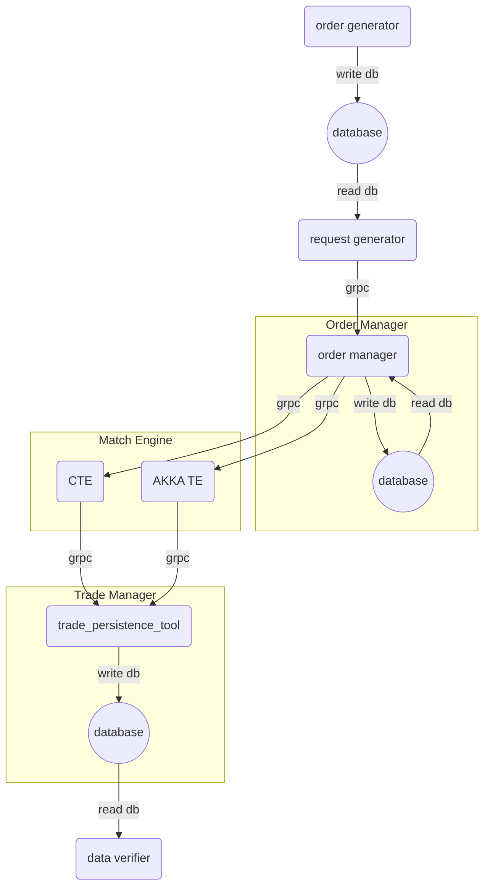
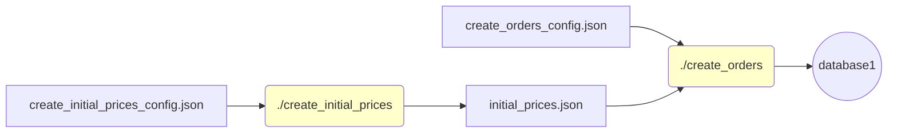
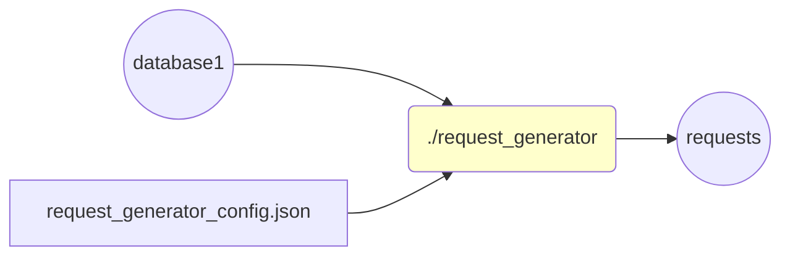
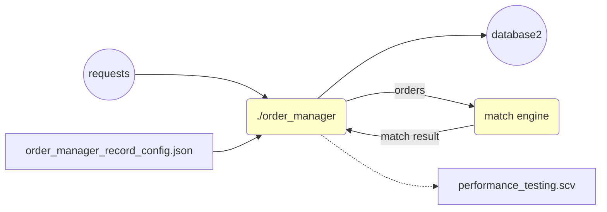
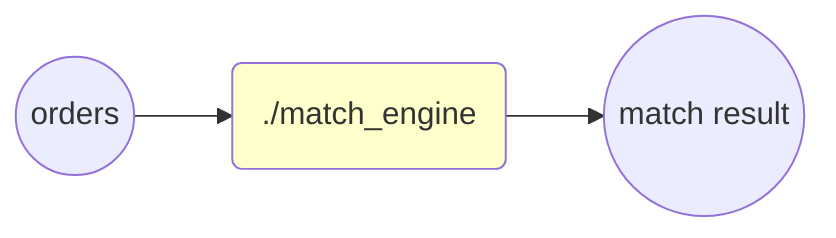
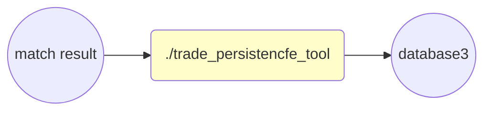
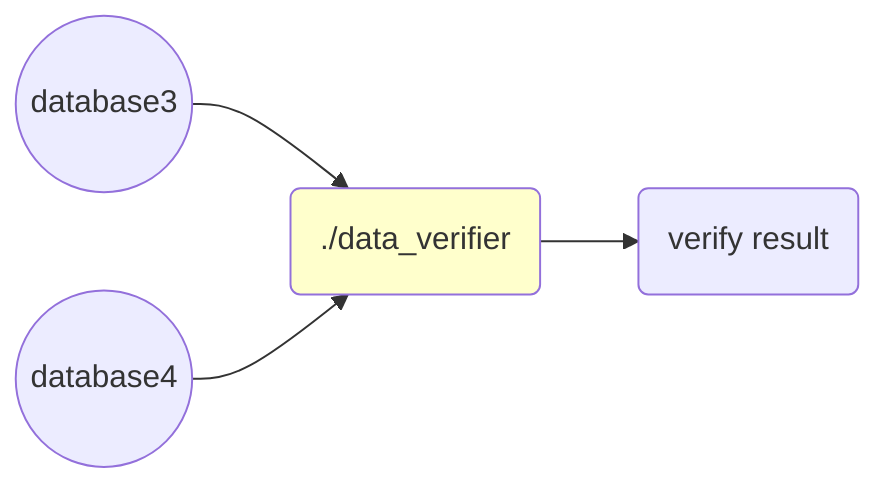
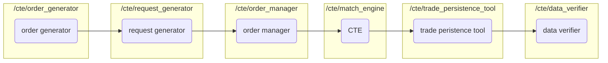

# CTE Develop Document

## 1 Introduction

CTE's full name is CDCF(C++ Distributed Computing Framework) Trading Engine. It was born to realize a trading engine with accurate business, stable performance and high efficiency. As a developer, this engine is also a way to verify the performance of CDCF.

### 1.1 CTE dependence

- **CDCF:** CTE match engine is based on CDCF
- **grpc/Protobuff**: different parts communicate
- **spdlog:** CTE logger
- **gTest**: test

### 1.2 CTE run environment

Linux OS, docker 19.03(optional)

### 1.3 CTE run environment

Linux OS: gcc 8.4, cmake 3.10, conan 1.24, git

Mac OS, clang 11.0.0, cmake 3.10, conan 1.24, git

### 1.4 Architecture diagram

CTE code consists of six parts: order generator, request generator, order manager, match engine, trade persistence tool and data verifier.

* **order generator:** under a certain strategy, it can generate valid raw order data and save those data to the database.
* **request generator:** read raw order data created by order generator from database and generate order request to order manager.
* **order manager:** receive requests from the request generator and save them as orders with status(unsubmitted, submitted, concluded and partially concluded) in the database.
* **match engine:** receive orders from order manager to do the order matching under the principle of price priority and time priority. (This match engine we prepare both CTE and AKKA TE, you can choose only CTE or both of them to compare the performance.)
* **trade manager:** subscribe the matching result from match engine and persist matching result as deal orders with unique trade ID and timestamp.
* **data verifier:** verify the correctness of the order from trade persistence tool, and compare result between akka-te and cte.



## 2 Getting started

### Build project

Down load CTE code

```sh
$ git clone https://github.com/thoughtworks-hpc/cte.git
$ cd cte
```

Config Conan

```shell
$ conan remote add inexorgame "https://api.bintray.com/conan/inexorgame/inexor-conan"
$ conan remote add hpc "https://api.bintray.com/conan/grandmango/cdcf"
$ mkdir build && cd build
$ conan install .. --build missing
```

Build Project

```shell
$ cmake .. -DCMAKE_TOOLCHAIN_FILE=conan_paths.cmake
$ cmake --build . -j
$ ctest .
```

Test

```shell
$ ctest  --output-on-failure
```

### Run project

This is the most simple way to run the whole project without AKKA TE. You can use it to check if the process you did before is correct. 

You can find out we start match engine, trade persistence and order manager before order generator and request generator, because the first three part need to be started first to wait for the data from order generator and request generator.

Those codes should be run in the current working directory(except running influxd) after you build your whole project. If you use follow the step in Build Project, you shoud have those excutable files in "cte/build/bin".

```shell
# start influxdb
$ influxd

# this number ba37b9c0a1842f6929ee6ddcac04324e84ef12ae of CDCF version may be different on 
# your computer, if this file does not exist, please check the 
# ~/.conan/data/cdcf/1.0/hpc/stable/package/ and change the number with what you have
$ cd ~/.conan/data/cdcf/1.0/hpc/stable/package/ba37b9c0a1842f6929ee6ddcac04324e84ef12ae/bin

# start cte match engine
# remember to change {Your user name} with yours
$ ./node_keeper --name=cte_match_engin_result_host --seeds=cte_match_engin_result_host:4445 --host="cte_match_engin_result_host" --port=4445 --role=merge_result_host --app=/Users/{Your user name}/Documents/cte/cte/build/bin/match_engine_server  --app-args=--symbol_id_list="1,2,3,4,5,6,7,8"

$ cd /cte/build

# start trade persistence
$ ./trade_persistence_tool_main  -m 127.0.0.1:51001 -d 127.0.0.1:8086 -t cte_trades -f ""

# start order manager
$ ./order_manager -a localhost:50051 -d localhost:8086 -m localhost:51001 -t 0

# start order generator
$ ./create_initial_prices
$ ./create_orders

# start request generator
$ ./request_generator_main

# start data verifier
$ ./data_verifier
```

## 3  How to use CTE

This section will explain how to use CTE in six parts separately (order generator, request generator, order manager, match engine, trade persistence tool and data verifier). It contains more arguments and config files than the simple way we mentioned in section 2.

### 3.1 Order generator

#### Usage Example

The order generator contains two part: **create initial prices** and **create orders**. Both of them are executable.

```shell
$ create_initial_price
$ create_order
```
The input and output are shown as below:


#### Create initial prices

In this part, initial prices can be created by **create_initial_price.cc** with a default config file (**create_initial_prices_config.json**) in the same src directory. Or you can choose your own json file by adding a parameter which should be your json file path as the program arguments.

The config file should in this form, with four arguments:

```json
{
  "symbol_id_min": 3,
  "symbol_id_max": 10,
  "price_min": 1,
  "price_max": 100
}
```

Initial prices will be created in a json file in your current working directory named **initial_prices.json**. In this file, initial prices are shown like`{"symbol_id": initial price}`.

> If you want to use the default config file, please make sure your current working dierectory is the same as the excutable file path.

#### Create Orders

In this part, a database named "orders" will be created and orders can be created by **create_orders.cc** with two default files(**initial_prices.json** and **create_orders_config.json**) in the same src directory. Or you can choose your own json files by adding two parameters which should be your json file pathes as the program arguments, in which the first one is like **initial_prices.json** and the second one is like **create_orders_config.json**.

The forms of  **initial_prices.json** and **create_orders_config.json** are shown:

initial_prices.json:

```json
{"1":5679,"10":8759,"2":3175,"3":5325,"4":5199,"5":6861,"6":5637,"7":3839,"8":9626,"9":665}
```

create_orders_config.json:

```json
{
  	"order_amount": 10000,
    "user_id_min": 1,
    "user_id_max": 100,
    "trading_amount_min": 100,
    "trading_amount_max": 1000,
    "database_host": "127.0.0.1",
    "database_port": 8086,
    "database_name": "orders",
    "database_user": "",
    "database_password": ""
}
```

Orders will be created in the influxdb database, whose database name and measurement are "orders".

> If you want to use the default config file, please make sure your current working dierectory is the same as the excutable file path.

### 3.2 Request generator

#### Usage example

```shell
$ ./request_generator_main -t 4 -n 10 -f [USER_DEFINE_CONFIG_FILE_PATH]
```

> -t, can overwrite the number of threads in config file

> -n can overwrite the number of requests to be sent in. config file

> -f define the config file path, default is "./request_generator_config.json"

The input and output are shown as below:



#### Config file


This file defines  basic configurations for request generator, you can modify it to meet your needs.

**src / request_generator_config.json**
```json
{
  "default_num_of_threads": 4,
  "default_num_of_requests": -1,
  "default_db_ip_address": "127.0.0.1",
  "default_db_port": "8086",
  "default_db_name": "orders",
  "database_user_name": "",
  "database_password": "",
  "grpc_server": [
    {
      "ip": "127.0.0.1",
      "port": "50051"
    },
    {
      "ip": "127.0.0.1",
      "port": "50052"
    },
    {
      "ip": "127.0.0.1",
      "port": "50053"
    }
  ]
}
```
>  note: "default_num_of_requests : -1" means  generator will send all orders in database. 

### 3.3 Order manager

#### Usage Example

```shell script
$ ./order_manager -a localhost:50051 -d localhost:8086 -m localhost:50052 -r localhost:50053,localhost:50054 -t 0
```

> -a, --service_address: Specify order manager service address;

> -d, --database_address: Specify database address which is used by the order manager

> -m, --match_engine_main_address: Specify match engine main address, main address supports both order matching request and result subscription

> -r, --match_engine_request_addresses: Specify match engine request only addresses, request only address supports only order matching request

> -h, --help: Print Usage

> -t, --test_mode_is_open: '0' means not open. '1' or other number means open, in this mode, order manager will not write database.

The input and output is shown as below:




#### Order Storage Location
Orders will be persisted to the specified influxdb in database "order_manager" with measurement of "order'.
#### Database Schema
Orders will be persisted to the database in the following form:
```text
time                        amount concluded amount order_id price status              symbol_id trading_side user_id
----                        ------ ---------------- -------- ----- ------              --------- ------------ -------
2020-09-02T06:15:37.678617Z 10     10               1        7     concluded           1         buy          1
2020-09-02T06:15:44.145088Z 5      2                2        7     partially concluded 1         sell         2
```
time: the generated timestamp when receiving order

amount: the amount of symbol to buy or sell

concluded amount: the amount of the order that has been concluded through transaction

order_id: generated unique identification of the order

price: the price at which to buy or sell the symbol

status: status of the order

    submitted: the order has been submitted to the match engine, no result yet
    
    partially concluded: the order has been partially concluded
    
    concluded: the order has been fully concluded

symbol_id: the symbol id representing the symbol to buy or sell

trading_side: the trading side the order is at, buy or sell

user_id: user identification

#### Record and Test mode

Record and test mode are two functions on order_manager to help to test the performance of match engine. 

When you need to record the send amount, receive amount and latency, you can send "MANAGER_START" message to the port on which run order manger, and startd sending orders. When sending orders finished, send "MANAGER_END" to the same port and you will get a **performance_testing.scv** file in the current running directory as the result report.

You can use **order_manager_record_config.json** to change the record time interval and latency average warning to meet your requirements.

```json
{
  "record_time_interval_in_seconds": 20,
  "latency_average_warning_in_milliseconds": 5
}
```


**Test mode** works for record function. It aims to help compare the performance between AKKA TE and CTE, in which order manager sending and receiving orders without writing database. In this way, the performance we get about match engine can be more specific and reasonable. 

You can add arguments `-t 0` to close this mode, and `-t 1` to open the mode. 

> Test mode should works with record switch open, and your persistence tool and data verifier will not receive any data to deal with.

### 3.4 Match engine

Match engine receive orders from order manager to do the order matching under the principle of price priority and time priority.

Codes about this function are in "cte/match_engine". It contains one excutable file(match_grpc_server.cc) based on CDCF, so we need to define some of the arguments for CDCF to use.

#### Usage Example

```shell
$ node_keeper --name="cte_match_engin_result_host" --seeds="cte_match_engin_result_host:4445" --host="cte_match_engin_result_host" --port=4445 --role="merge_result_host" --app=""/bin/match_engine_server"  --app-args="--symbol_id_list='1,2,3,4,5,6,7,8'"
```

The input and output are shown as below:



#### Node_keeper Arguments

These arguments are used for CDCF's node keeper. They are set for actor system, which are necessary when we use CDCF.

> --name, define name of the actor system, such as cte_match_engin_result_host

> --seeds, define seed of the actor system, such as cte_match_engin_result_host:4445

> --host, define host of the actor system, such as cte_match_engin_result_host

> --port, define port of the actor system, such as 4445

> --role, define role of the actor system, such as merge_result_host

>--app, define app of the actor system, in our project, we use /bin/match_engine_server

#### App Arguments

These arguments are for our project specificlly, in which --symbol_id_list is necessary, while --log_file and --log_level are optional.

> --symbol_id_list, define the symbol id needed to be deal in this app

> --log_file, define the path of log file

> --log_level, define the level of logs you can choose, such as debug

#### Engine Switch

We provide engine swtich gprc service for open or close the match engine. 

You can send message like "ENGINE_CLOSE" or "ENGINE_OPEN" to the port on which run the match engine to open or close the match engine. When you close match engine, order manager cannot submit orders to match engine.

### 3.5 Trade persistence Tool

#### Usage Example

```shell
$ ./trade_persistence_tool_main  -m 127.0.0.1:50051 -d 127.0.0.1:8086 -t cte_trades
```
The input and output are shown as below:




#### Key Arguments

> -d, define database ip and port

> -m, define match engine ip and port

> -t, define database table name, tool will create a table named by this argument

#### Optional Arguments
> -u, define database username, default is ""

> -p, define database password, default is ""

> -l, define log level, default is "info"
> Potential log levels:
> "trace", "debug", "info", "warning", "error", "critical", "off"

> -f, define log file output path, default is "/tmp/trade_persistence_tool.log"

> -n, define database name, tool will create a database named by this argument, default is "trade_manager"

### 3.6 Data verifier

#### Usage Example
Directly run data_verifier, configuration must be set via json file.

```shell
$ ./data_verifier
```
The input and output are shown as below:



With the following json file named "data_verifier_config.json" in the same directory.

```json
{
    "server": [
      {
        "host": "127.0.0.1",
        "port": 55555,
        "database": "trade_manager",
        "measurement": "cte_trades",
        "user": "",
        "password": ""
      },
      {
        "host": "127.0.0.1",
        "port": 55555,
        "database": "trade_manager",
        "measurement": "cte_trades",
        "user": "",
        "password": ""
      }
    ],
    "level_log": "info",
    "ordered_data_sources": true,
    "compare_entire_data_source_in_one_turn": true,
    "number_of_entries_to_compare_each_turn": 10000,
  	"log_file_path": "data_verifier.log"
}
```


#### Configuration
> "server": must specify 2 influxdb server as 2 data sources to compare

> "level_log": log level which typically has value "info" or "debug".

> "ordered_data_sources": whether the data sources has ordered data sets.
> Comparison between ordered data sources will be much faster.

> "compare_entire_data_source_in_one_turn", "number_of_entries_to_compare_each_turn": 
> whether to compare every data entries from 2 data sources in one turn 
> or in several turns and in each turn compare [number_of_entries_to_compare_each_turn] of entries. 

> "log_file_path": the path you want to save logs.

### 3.7 Option: How to compare CTE and AKKA TE

We also provided AKKA TE which is a match engine created by AKKA. This allows us to compare performance between CTE and AKKA TE. All of the other workflows are the same, except we change match engine from CTE to AKKA TE.

If you need **AKKA TE** and want to compare the performance between CTE and AKKA TE, you can use those commands to run the whole project. 

We should down load it first.

```shell
$ git clone https://github.com/thoughtworks-hpc/akka-te.git
$ mvn package
```

Since AKKA TE need another trade persistence and order manager, we need to add those two tools and you should change the default port if ports conflict.

> Note: These commands are only for reference. Default arguments should be changed according to section 3.1-3.6 to match port or avoid port conflict. We recommond to use docker cluster and the steps are in section 4.

```shell
# start influxdb
$ influxd

# this number ba37b9c0a1842f6929ee6ddcac04324e84ef12ae of CDCF version may be different on 
# your computer, if this file does not exist, please check the 
# ~/.conan/data/cdcf/1.0/hpc/stable/package/ and change the number with what you have
$ cd ~/.conan/data/cdcf/1.0/hpc/stable/package/ba37b9c0a1842f6929ee6ddcac04324e84ef12ae/bin

# start cte match engine
$ ./node_keeper --name=cte_match_engin_result_host --seeds=cte_match_engin_result_host:4445 --host="cte_match_engin_result_host" --port=4445 --role=merge_result_host --app=/Users/{Your user name}/Documents/cte/cte/build/bin/match_engine_server  --app-args=--symbol_id_list="1,2,3,4,5,6,7,8"

$ cd /cte/build

# start akka te engine
$ cd /akka-te/target
$ java -Dconfig.file="../config/local_node.conf" -jar app-1.0-allinone.jar
$ java -Dconfig.file="../config/local_gateway.conf" -jar app-1.0-allinone.jar

# start trade persistences
$ ./trade_persistence_tool_main  -m 127.0.0.1:50051 -d 127.0.0.1:8086 -t cte_trades
$ ./trade_persistence_tool_main  -m 127.0.0.1:50053 -d 127.0.0.1:8086 -t akka_te_trades

# start order managers
$ ./order_manager -a localhost:50051 -d localhost:8086 -m localhost:50052 -t 0
$ ./order_manager -a localhost:50053 -d localhost:8086 -m localhost:50054 -t 0

# start order generator
$ ./create_initial_price
$ ./create_order

# start request generator
$ ./request_generator_main

# start data verifier
$ ./data_verifier
```

## 4 How to set up CTE with docker compose

#### 4.1 Set up CTE with docker compose

We recommand to use docker compose, since it can easily set up a cluster. This whole project can be set up by docker compose with a Dockerfile in "cte/" and other files in "**cte/docker**".

We can build cte project by **docker-compose-without-akka.yml**.

```shell
$ cd cte/docker
$ docker build .. -t cte
$ docker-compose -f docker-compose-without-akka.yml up
```

We will get six images after running docker-compose. In the **request_generator** image, we need to use some commands to run the project.

```shell
$ bash
$ cd bin
$ create_initial_price
$ create_order
$ request_generator_main -f request_generator_cte_config.json
```

Data verifier can be used on the **trade_receiver** image after getting all the trades if you need to compare them.

```shell
$ bash
$ cd bin
$ data_verifier
```

#### 4.2 Option: Add AKKA TE in our docker cluster

If you do not need AKKA TE, you can skip this section.

In this docker directory we also provided AKKA TE which is a match engine created by akka. This allows us to compare performance between CTE and AKKA TE. All of the other workflows are the same, except we change match engine from CTE to AKKA TE.

We build the AKKA TE image first.

```shell
$ git clone https://github.com/thoughtworks-hpc/akka-te.git
$ git checkout build-in-docker
$ ./build-docker-image
```

After that, we build our project with docker compose.

```shell
$ cd cte/docker
$ docker build .. -t cte
$ docker-compose -f docker-compose.yml up
```

Since akka-te is needed to run, both **request_generator_cte_config.json** and **request_generator_akka_config.json** need to run in the **request_generator** image.

```shell
$ bash
$ cd bin
$ create_initial_price
$ create_order
$ request_generator_main -f request_generator_cte_config.json
$ request_generator_main -f request_generator_akka_config.json
```

Data verifier can be used on the **trade_receiver** image after getting all the trades if you need to compare them.

```shell
$ bash
$ cd bin
$ data_verifier
```

## 5 Code and maintenance

 #### Common

1. **/cte/common**

There are two directories in "**/cte/common**", which are include and protobuf.

"**/cte/common/include**" contains three hpp files: cxxopts.hpp, influxdb.hpp and json.hpp.

- **cxxopts.hpp**: this file is used in order manager to read the arguments.
- **Influxdb.hpp**: we use influxdb in our project. This file helps to operate with influxdb in our project when we need to write or read database. If you want to know more about influxdb, you can check the directory "/cte/influxdb_usa_demo". 
- **Json.hpp**: this file is used to read json file or do transform from string to json. Since we have some configuration in json file, we use this Json.hpp to read those files. And when we read data from database, it can be a string, so we need to transform to more readable form.

"**/cte/common/protobuf**" contains two files: match_engine.proto and order_manager.proto. Both of them are used for grpc service. The first one is for match engine to define the message it received, while the second one is for order manager to define the message it received.

2. **cte/docker**

The codes used in docker are in "**cte/docker**" directory like we mentioned in section 4.

3. **/cte/influxdb_usa_demo**

There is a influxdb demo you can have a look for more information about how to use influxdb with C++, which is in "**/cte/influxdb_usa_demo**".

#### Specific Code

Other codes are about the six parts mentioned in section 1.4, which are order generator, request generator, order manager, match engine, trade persistence tool and data verifier. These are the location of code with those six specific part.

* **order generator:** "/cte/order_generator"
* **request generator:** "/cte/request_generator"
* **order manager:** "/cte/order_manager"
* **match engine:** "/cte/match_engine"
* **trade persistence tool:** "/cte/trade_persistence_tool"
* **data verifier:** "/cte/data_verifier"

The relationship between part and code with workflow is shown as below:



